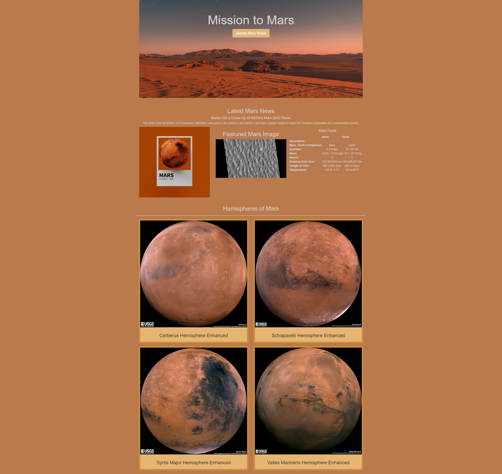

# Mission-to-Mars
## Project Overview
The purpose of this assignment was to create a web application with Flask that can comb through and scrape data from multiple websites with information about Mars. The scraped data was stored in a MongoDB database, then displayed on a HTML page with some CSS customization and mobile responsiveness. 

Attached below is a screenshot of the webpage. 

